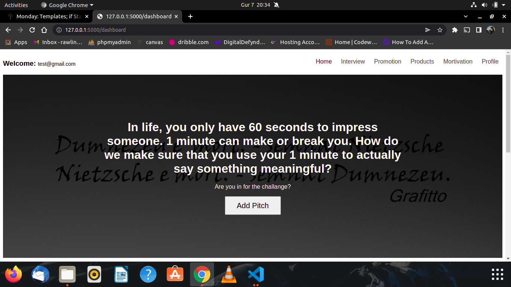

## PROJECT TITLE: QUOTE PITCHING APP
## AUTHOR: UHURU OTIENO RAWLINGS
## DESCRIPTION:
This is a flask application that allows the users to signup , login and post quotes and allow others to like and comment on the posts.
## PROJECT FETURES

## SET UP INSTRUCTION
This project uses python so you need to install python.
If you are using ubuntu it has python 3.6 installed, you can upgrade to another version or just used the same version
to install pyhton in ubuntu terminal
<code>$ sudo add-apt-repository ppa:jonathonf/python-3.6</code>
 
<code>$ sudo apt-get update</code>
 
<code>$ sudo apt-get install python3.6</code>
 
<code>$ pip install flask</code>
 
<code>$ pip install psycopg2</code>
 
In windows you will need to download python lastest version from python official website and install
## RUNNING THE PROJECT
The project can be run on the browser by typing <code>python3 run.py</code> where run.py is responsible for running the project.
## HOW THE PROJECT LOOKS LIKE
